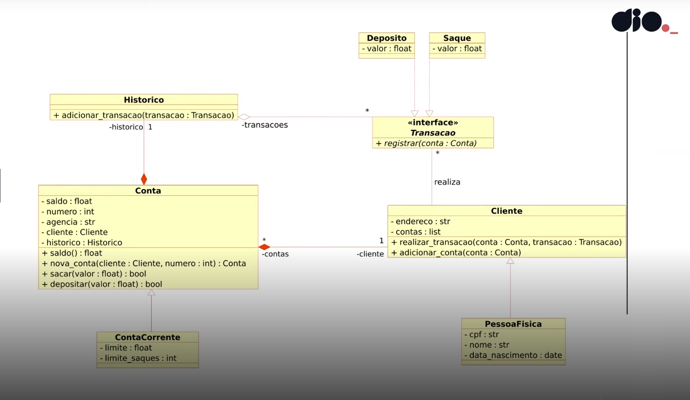

# Desafio DIO: Modelando o Sistema Bancário em POO com Python

Desafio proposto pela [DIO](https://dio.me/) no BootCamp "NTT DATA - Engenharia de Dados com Python".

## Objetivo Geral:

Iniciar a modelagem do sistema bancário em POO. Adicionar classes para cliente e as operações bancárias: depósito e saque

### Desafio

Atualizar a implementação do sistema bancário, para armazenar os dados de clientes e contas bancárias em objetos ao invés de dicionários. O código deve seguir o modelo de classes UML a seguir:

## Update

Novas implementações:

#### Decoradores de log:
- Decorardor aplicado a todas as funções
- Registra data e hora de cada ação, assim como o tipo da ação
- Salva registro em arquivo de log (v3)

#### Gerador de relatórios:
- Gerador que itera sobre as transações da conta e retorna uma a uma as transações que foram realizadas
- É possivel filtrar as transações por tipo (saques, depositos ou todos) através de um menu

#### Iterador personalizado:
- Iterador que retorna informações básicas de cada conta